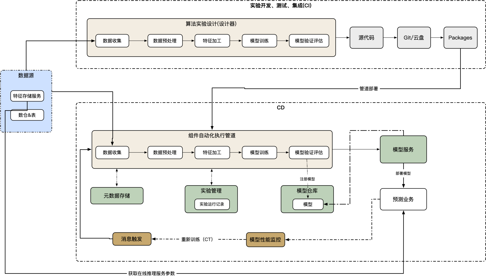

### 机器学习平台实现MLOps的设计思路


在前面的文章中介绍了机器学习平台相关内容，本文主要介绍MLOps，因为在我们不断的去深入理解机器学习平台过程中，也是逐渐向MLOps逼近的。在机器学习工程化的过程中也是逐步演进的。为什么要做这件事，前文介绍了很多了。


**MLOps是什么**

MLOps(a compound of “machine learning” and “operations”) is a practice for collaboration and communication between data scientists and operations professionals to help **manage production ML (or deep learning) lifecycle**.[1] Similar to the DevOps or DataOps approaches, MLOps looks to increase automation and improve the quality of production ML while also focusing on business and regulatory requirements. While MLOps also started as a set of best practices, it is slowly evolving into an independent approach to ML lifecycle management. MLOps applies to the entire lifecycle - from integrating with **model generation** (software development lifecycle, continuous integration/continuous delivery), orchestration, and deployment, to health, **diagnostics**, **governance**, and business metrics. According to Gartner, MLOps is a subset of ModelOps. **MLOps is focused on the operationalization of ML models**, while ModelOps covers the **operationalization of all types of AI models。**


上面是维基百科中对MLOps的定义，通过了解总结下MLOps的实现目标


1. 管理模型声明周期

2. 聚焦于ML Model的运维治理

3. 模型类型不固定，支持所有框架

4. 模型重新训练

5. 模型可重用

6. 实现ML的 CI、CD、CT

   


MLOps技术架构





从上图中分析下具有哪些特性


**快速实验**：机器学习实验的步骤已经过编排。各个步骤之间的转换是自动执行的，这样可以快速迭代实验，并更好地准备将整个流水线移至生产环境。


**生产环境中的模型CT**：系统会在生产环境中根据**实时Pipeline触发器**使用新数据自动训练模型。


**开发与运维**：在开发或运维环境中使用的Pipeline会在预生产和生产环境中使用，这是 MLOps 做法的主要方面，用于统一 DevOps。


**组件化**：构建机器学习流水线，组件必须可重复使用、可组合，组件的源代码必须模块化。


**模型性能监控与模型重新训练**

在自动执行机器学习生产环境Pipeline，可以根据规则触发使用新数据重新训练模型

- 按需：临时手动执行流水线。
- 时间调度：每天、每周等定期执行
- 新训练数据的可用性：新数据的变化及可用性验证，重新训练。
- 模型性能下降时：模型在性能明显下降时重新训练。


**Pipeline示例代码**


下面介绍Alink pipeline实现代码

```java
public class KMeansExample {

    public static void main(String[] args) throws Exception {
        String URL = "https://alink-release.oss-cn-beijing.aliyuncs.com/data-files/iris.csv";
        String SCHEMA_STR = "sepal_length double, sepal_width double, petal_length double, petal_width double, category string";

        BatchOperator data = new CsvSourceBatchOp().setFilePath(URL).setSchemaStr(SCHEMA_STR);

        VectorAssembler va = new VectorAssembler()
            .setSelectedCols(new String[]{"sepal_length", "sepal_width", "petal_length", "petal_width"})
            .setOutputCol("features");

        KMeans kMeans = new KMeans().setVectorCol("features").setK(3)
            .setPredictionCol("prediction_result")
            .setPredictionDetailCol("prediction_detail")
            .setReservedCols("category")
            .setMaxIter(100);

        Pipeline pipeline = new Pipeline().add(va).add(kMeans);
        pipeline.fit(data).transform(data).print();
    }
}
```

