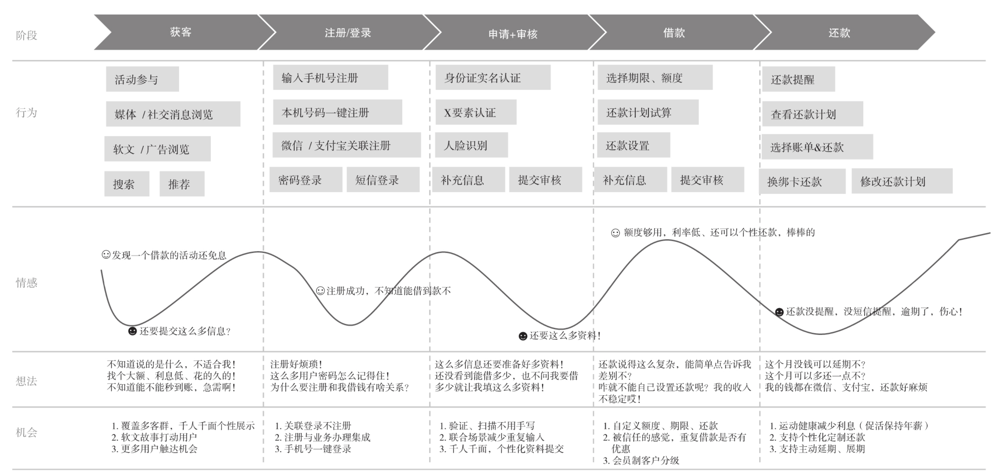

## 互联网消费金融：业务架构、运营和数字化转型

最近刚读完一本《互联网消费金融》的书，本书主要从互联网消费金融的核心概念、生态、趋势和痛点，旨在让读者对这个行业有一个整体认识。

以构建成功的**客户旅程**为切入点，如何以用户为中心来设计互联网消费金融类产品，这是产品创新的关键。在业务架构方法论上具体讲解了银行、消费金融公司、金融科技公司的互联网消费金融的业务架构案例。

金融性质的业务更加注重客户服务及运营，在这方面详细介绍了相关的实操方法。在互联网消费金融行业数字化转型上作者给出了自己的理解。同时介绍了头部互联网金融消费平台给我们的启示，以及行业未来的机遇和挑战

#### 什么是客户旅程

客户旅程( Customer Journey)是客户了解、考虑和评估并决定购买新产品和服务的过程。客户旅程主要包括品牌认知、业务评估和決策购买3个阶段。品牌认知阶段是客户意识到自身所面临的问题的阶段，业务评估阶段是客户定义问题并研究解决问题的方法的阶段，决策购买阶段是客户选择相应的产品或服务的阶段。

客户旅程并不是一个新的概念，

客户旅程描述了一段时期内客户在使用产品或者服务时的体验，是通过可视化的方式从客户的角度来表现其和产品/组织/服务互动的过程,即连续时间内客户与多个触点互动的完整故事。

上图是一个典型的消费信贷客户旅程